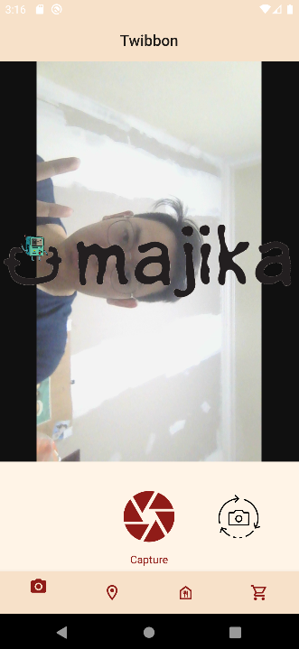

<a id="readme-top"></a>
<br />

<div align="center">
  <a href="https://gitlab.informatika.org/rannnayy/if3210-2023-android-rbk">
    
  </a>

  <h3 align="center">Majika</h3>

  <p align="center">
    :indonesia: Platform Pemesanan Makanan Karya Anak Bangsa :indonesia:<br>
    Penantang G*food dan S*****food sebagai platform pemesanan makanan terbaik di Indonesia
</div>

<!-- TABLE OF CONTENTS -->
<details>
  <summary>Table of Contents</summary>
  <ol>
    <li>
      <a href="#about-the-project">About The Project</a>
      <ul>
        <li><a href="#built-with">Built With</a></li>
      </ul>
    </li>
    <li>
      <a href="#getting-started">Getting Started</a>
      <ul>
        <li><a href="#prerequisites">Prerequisites</a></li>
        <li><a href="#installation">Installation</a></li>
      </ul>
    </li>
    <li><a href="#usage">Usage</a></li>
    <li><a href="#contributions">Contributions</a></li>
    <li><a href="#contact">Contact</a></li>
  </ol>
</details>

<!-- ABOUT THE PROJECT -->

## About The Project

Majika adalah sebuah mobile app berbasis android yang berfungsi untuk membantu user dalam mencari dan memesan makanan. App tersebut kami buat untuk ~memenuhi Tugas Besar 1 IF3210 Teknik Informatika ITB~ meningkatkan kualitas layanan pemesanan makanan di Indonesia. Berbeda dari aplikasi pemesanan makanan lainnya seperti G\*food dan S**\***food, Majika dapat membantu user untuk memesan makanan dari seluruh belahan dunia ~dikirimnya gimana sih bomat yg penting bisa mesennya~. Karena fitur tersebut, 9 dari 10 dokter gigi merekomendasikan Majika sebagai aplikasi pemesanan makanan ~terburuk~ terbaik di Indonesia.

Sebagai aplikasi mobile yang ~tidak~ direkomedasikan oleh 9 dari 10 dokter gigi, Majika memiliki fitur yang sangat ~tidak~ lengkap dan keren. User tidak perlu login terlebih dahulu untuk dapat memesan makanan. User dapat langsung menggunakan aplikasi. User dapat mencari makanan dan minuman yang mereka inginkan dan mereka dapat langsung memasukannya ke dalam keranjang. Setelah selesai memilih, user dapat masuk ke laman pembayaran untuk melakukan pembayaran. Pembayaran dilakukan dengan melakukan scan barcode dan jika user menyeken barcode yang benar, maka secara ajaib biaya makanan tersebut lunas entah dibayar siapa :lol:. Setelah itu, user dapat mengambil makanan tersebut melalui cabang terdekat yang dapat dilihat di menu cabang.

<p align="right">(<a href="#readme-top">back to top</a>)</p>

### Built With

- Kotlin Native
- Android Studio
- Libraries:
  1. CameraX
  2. ZXing
  3. Retrofit
  4. Room
  5. Coroutines

<p align="right">(<a href="#readme-top">back to top</a>)</p>

<!-- GETTING STARTED -->

## Getting Started

Tanpa Berlama-lama inilah cara menjalankan web app

### Prerequisites

- Android Studio
  ```sh
  https://developer.android.com/studio
  ```
- Otak
  ```sh
  https://www.google.com/search?q=otak
  ```

### Installation

1. Clone Repo ini dengan menggunakan cmd pada directory yang diinginkan
   ```sh
   C:\Users\MerekLaptop>
   git clone https://gitlab.informatika.org/rannnayy/if3210-2023-android-rbk
   ```
2. Buka Directory tempat file di clone
   ```sh
   C:\Users\MerekLaptop> cd if3210-2023-android-rbk
   C:\Users\MerekLaptop\if3210-2023-android-rbk>
   ```
3. Buka Android Studio pada directory tersebut
4. Download data pada tautan berikut:
   ```sh
   https://drive.google.com/drive/folders/1wvzs-EiE9iQ3ysn3RIIBA9D_hFUQeuF4
   ```
5. Jalankan data pada terminal (caranya cari sendiri ya ~karna saya malas nulisnya~ biar pinter)
6. Buka RetrofitClient.kt pada directory app/src/main/java/com/example/majika/retrofit dan ubah BASE_URL menjadi IP Address yang digunakan pada terminal (cari IP Address dengan ipconfig pada cmd + otak + google)
7. Run app pada Android Studio detailnya cari sendiri ya ~karna saya malas nulisnya~ biar pinter
8. Enjoy
<p align="right">(<a href="#readme-top">back to top</a>)</p>

<!-- USAGE EXAMPLES -->

## Usage
0. Splash Screen
   
1. Camera
   
   
   

2. Cabang
   
   
   

3. Menu
   
   
   
   
   
   

4. Keranjang
   

5. Scan Barcode
   
   

<!-- CONTRIBUTING -->

## Contributions

| feature            | 13520019           | 13520034           | 13520040           |
| ------------------ | ------------------ | ------------------ | ------------------ |
| Twibbon Page       | :heavy_check_mark: | :heavy_check_mark: |                    |
| Branch Page        | :heavy_check_mark: |                    | :heavy_check_mark: |
| Menu Page          | :heavy_check_mark: |                    |                    |
| Cart Page          | :heavy_check_mark: |                    | :heavy_check_mark: |
| Payment Page       | :heavy_check_mark: | :heavy_check_mark: |                    |
| Responsive Page    | :heavy_check_mark: |                    |                    |
| Navigation Bar     | :heavy_check_mark: |                    |                    |
| Camera             |                    | :heavy_check_mark: | :heavy_check_mark: |
| Map                |                    | :heavy_check_mark: | :heavy_check_mark: |
| Email              |                    | :heavy_check_mark: | :heavy_check_mark: |
| Temperature        |                    | :heavy_check_mark: | :heavy_check_mark: |
| QR Scanner         | :heavy_check_mark: | :heavy_check_mark: |                    |
| Database           | :heavy_check_mark: |                    | :heavy_check_mark: |
| Offline Capability | :heavy_check_mark: | :heavy_check_mark: | :heavy_check_mark: |

<p align="right">(<a href="#readme-top">back to top</a>)</p>

<!-- LICENSE -->

## License

Distributed under the NG License. See you again for more information.

<p align="right">(<a href="#readme-top">back to top</a>)</p>

<!-- CONTACT -->

## Contact

| Name                      | Contact                     | Github                                                            | Estimated Time For This Project |
| ------------------------- | --------------------------- | ----------------------------------------------------------------- | ------------------------------- |
| Maharani Ayu Putri Irawan | 13520019@std.stei.itb.ac.id | <a href="https://www.github.com/rannnayy">@rannnayy</a>           | 83 hours                        |
| Bryan Bernigen            | 13520034@std.stei.itb.ac.id | <a href="https://www.github.com/bryanbernigen">@bryanbernigen</a> | 64 hours                        |
| Ng Kyle                   | 13520040@std.stei.itb.ac.id | <a href="https://www.github.com/Nk-Kyle">@Nk-Kyle</a>             | 67 hours                        |

<p align="right">(<a href="#readme-top">back to top</a>)</p>
